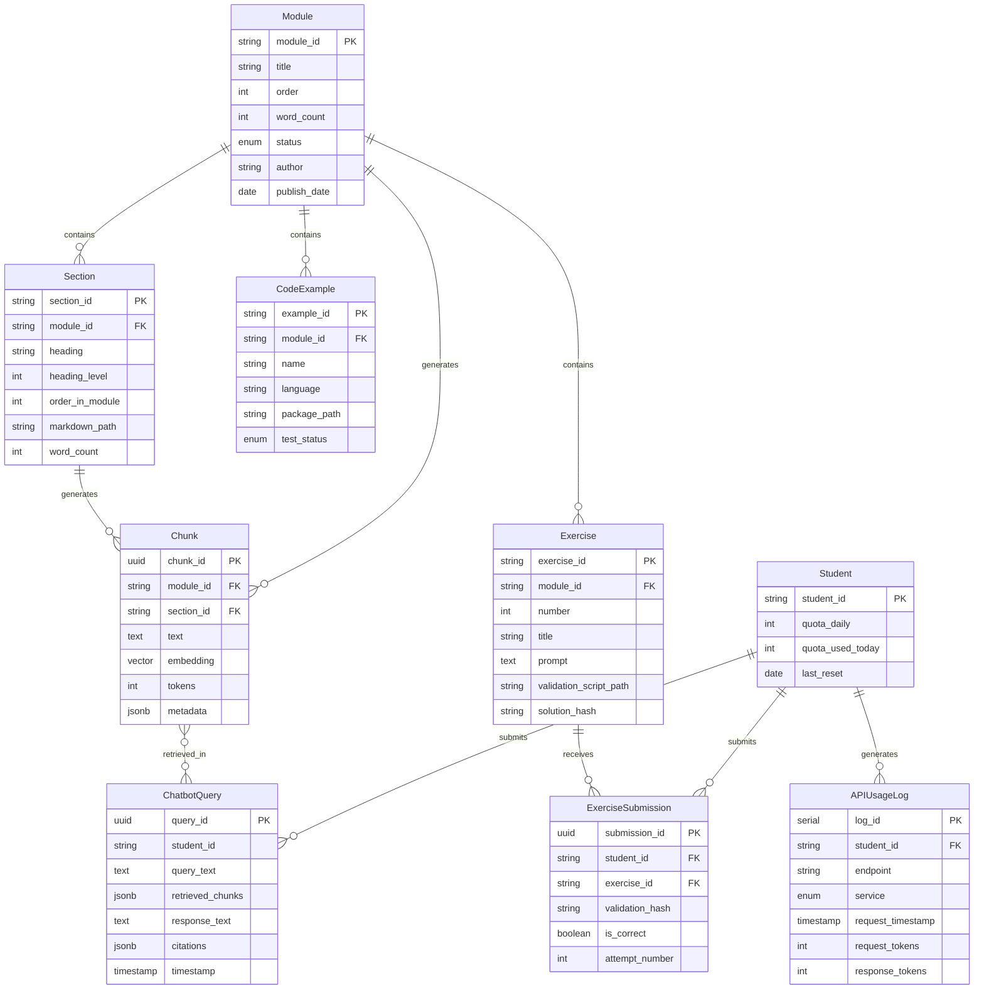

# Data Model: Physical AI & Humanoid Robotics

**Feature**: Physical AI & Human oid Robotics Capstone Quarter
**Phase**: 1 (Design & Contracts)
**Date**: 2025-12-15

## Overview

This document defines the core entities, relationships, validation rules, and state transitions for the Physical AI book project (Phase 1: Module 1 + Chatbot v1).

---

## Core Entities

### 1. Module

Represents one instructional unit of the book.

**Fields**:
- `module_id` (string, PK): Unique identifier (e.g., `module-1-ros2`)
- `title` (string): Display title (e.g., "Module 1: ROS 2 Fundamentals")
- `order` (int): Sequence number (1-5)
- `word_count` (int): Total words in module
- `status` (enum): `draft`, `review`, `published`
- `author` (string): Primary author name
- `publish_date` (date, nullable): Date published to GitHub Pages
- `created_at` (timestamp)
- `updated_at` (timestamp)

**Relationships**:
- Has many `Section`
- Has many `CodeExample`
- Has many `Exercise`
- Has many `Chunk` (RAG chunks derived from content)

**Validation Rules**:
- `word_count` must be 8,000-12,000 for `status=published`
- `order` must be unique and sequential (1, 2, 3, 4, 5)
- `module_id` must match format `module-{order}-{slug}`

**State Transitions**:
```
draft → review → published
        ↓
      draft (if revisions needed)
```

---

### 2. Section

Represents a section or subsection within a module (corresponds to Markdown `##` or `###` headings).

**Fields**:
- `section_id` (string, PK): Unique identifier (e.g., `module-1-ros2/2-pubsub`)
- `module_id` (string, FK → Module)
- `heading` (string): Section title (e.g., "Publisher-Subscriber Pattern")
- `heading_level` (int): 2 for `##`, 3 for `###`
- `order_in_module` (int): Sequence within module
- `markdown_path` (string): Path to Markdown file (e.g., `docs/module-1-ros2/2-pubsub.md`)
- `word_count` (int)
- `has_code` (boolean): True if contains code blocks
- `has_diagram` (boolean): True if references diagrams
- `created_at` (timestamp)
- `updated_at` (timestamp)

**Relationships**:
- Belongs to one `Module`
- Has many `Chunk` (multiple chunks may come from one section)

**Validation Rules**:
- `heading_level` must be 2 or 3
- `markdown_path` must exist on filesystem
- `order_in_module` must be unique within `module_id`

---

### 3. CodeExample

Represents a runnable code example (ROS 2 package or script).

**Fields**:
- `example_id` (string, PK): Unique identifier (e.g., `module1-publisher-example`)
- `module_id` (string, FK → Module)
- `name` (string): Display name (e.g., "Publisher Example")
- `description` (text): What the example demonstrates
- `language` (enum): `python`, `cpp`
- `package_path` (string): Path in `ros2_workspace/src/` (e.g., `module1_examples/publisher_example`)
- `test_command` (string): Command to run test (e.g., `colcon test --packages-select publisher_example`)
- `expected_output` (text): Documented expected output
- `test_status` (enum): `pass`, `fail`, `not_run`
- `last_test_run` (timestamp, nullable)
- `created_at` (timestamp)
- `updated_at` (timestamp)

**Relationships**:
- Belongs to one `Module`
- Referenced by multiple `Section` (via Markdown links)

**Validation Rules**:
- `package_path` must exist on filesystem
- `test_command` must be executable in Docker container
- `test_status=pass` required for module `status=published`

---

### 4. Exercise

Represents a learning activity with validation.

**Fields**:
- `exercise_id` (string, PK): Unique identifier (e.g., `module1-ex1-pubsub`)
- `module_id` (string, FK → Module)
- `number` (int): Exercise number within module (1, 2, 3, ...)
- `title` (string): Exercise title (e.g., "Implement Publisher-Subscriber")
- `prompt` (text): Instructions for students
- `acceptance_criteria` (text): How to determine correctness
- `validation_script_path` (string): Path to `validate.py` or `validate.sh`
- `solution_hash` (string): SHA-256 hash of expected validation output
- `nonce` (string): Instructor-provided secret for hash validation
- `difficulty` (enum): `easy`, `medium`, `hard`
- `estimated_time_minutes` (int)
- `created_at` (timestamp)
- `updated_at` (timestamp)

**Relationships**:
- Belongs to one `Module`
- Has many `ExerciseSubmission` (student submissions)

**Validation Rules**:
- `validation_script_path` must be executable
- `solution_hash` must be 64-character hex string (SHA-256)
- `nonce` must be kept secret from students

---

### 5. Chunk (RAG)

Represents a text segment vectorized for RAG retrieval.

**Fields**:
- `chunk_id` (UUID, PK): Unique identifier
- `module_id` (string, FK → Module)
- `section_id` (string, FK → Section, nullable)
- `text` (text): Chunk content (750 tokens max)
- `embedding` (vector[1536]): OpenAI text-embedding-3-large vector
- `tokens` (int): Token count (calculated with tiktoken)
- `chunk_index` (int): Index within section (0, 1, 2, ...)
- `metadata` (jsonb): Additional fields:
  - `heading` (string): Section heading
  - `page_range` (string): Estimated page in PDF
  - `code_language` (string, nullable): If contains code
  - `has_diagram` (boolean)
  - `diagram_ref` (string, nullable): Path to diagram image
- `created_at` (timestamp)
- `updated_at` (timestamp)

**Relationships**:
- Belongs to one `Module`
- Belongs to one `Section` (nullable for intro/outro content)

**Validation Rules**:
- `tokens` must be ≤750
- `embedding` must be 1536-dimensional vector
- `text` must not be empty

**Indexing**:
- Vector index on `embedding` (cosine similarity)
- B-tree index on `module_id` for metadata filtering

---

### 6. ChatbotQuery

Represents a user query to the RAG chatbot.

**Fields**:
- `query_id` (UUID, PK): Unique identifier
- `student_id` (string, nullable): Anonymous student ID (if authenticated)
- `query_text` (text): User's question
- `query_embedding` (vector[1536]): Vectorized query
- `retrieved_chunks` (jsonb): Array of chunk IDs and similarity scores
- `response_text` (text): Generated answer
- `citations` (jsonb): Array of module/section references
- `feedback_rating` (int, nullable): 1-5 rating (optional user feedback)
- `feedback_text` (text, nullable): Optional user comment
- `response_time_ms` (int): Time to generate response
- `timestamp` (timestamp)

**Relationships**:
- References multiple `Chunk` (via `retrieved_chunks` jsonb field)

**Validation Rules**:
- `query_text` must not be empty
- `retrieved_chunks` must contain ≤5 chunk IDs
- `citations` must reference valid module/section pairs
- `feedback_rating` must be 1-5 if provided

---

### 7. Student

Represents a student using the course materials.

**Fields**:
- `student_id` (string, PK): Unique identifier (university ID or generated)
- `jwt_secret` (string): Per-student JWT secret (or reference to global secret)
- `quota_daily` (int): API requests per day (default: 100)
- `quota_used_today` (int): Requests used today (resets at UTC midnight)
- `last_reset` (date): Date of last quota reset
- `created_at` (timestamp)
- `last_active` (timestamp)

**Relationships**:
- Has many `ChatbotQuery`
- Has many `APIUsageLog`
- Has many `ExerciseSubmission`

**Validation Rules**:
- `quota_daily` must be >0
- `quota_used_today` must be ≤`quota_daily`

**State Transitions**:
- `quota_used_today` increments on each API request
- `quota_used_today` resets to 0 at UTC midnight (tracked by `last_reset`)

---

### 8. APIUsageLog

Represents a logged API request (chatbot or VLA).

**Fields**:
- `log_id` (serial, PK): Auto-increment ID
- `student_id` (string, FK → Student)
- `endpoint` (string): API endpoint (e.g., `/v1/chat/completions`)
- `service` (enum): `chatbot`, `vla`
- `request_timestamp` (timestamp)
- `response_timestamp` (timestamp)
- `request_tokens` (int): Tokens in request
- `response_tokens` (int): Tokens in response
- `cost_usd` (decimal): Estimated API cost
- `quota_remaining` (int): Quota after this request
- `status_code` (int): HTTP status (200, 429, 500, etc.)

**Relationships**:
- Belongs to one `Student`

**Validation Rules**:
- `request_tokens` and `response_tokens` must be ≥0
- `cost_usd` must be ≥0
- `status_code` must be valid HTTP status

**Indexing**:
- Index on `(student_id, DATE(request_timestamp))` for daily quota queries

---

### 9. ExerciseSubmission

Represents a student's exercise submission (hash).

**Fields**:
- `submission_id` (UUID, PK): Unique identifier
- `student_id` (string, FK → Student)
- `exercise_id` (string, FK → Exercise)
- `validation_hash` (string): SHA-256 hash from validation script
- `timestamp` (timestamp): When submitted
- `is_correct` (boolean): True if hash matches `exercise.solution_hash`
- `attempt_number` (int): How many times student submitted this exercise

**Relationships**:
- Belongs to one `Student`
- Belongs to one `Exercise`

**Validation Rules**:
- `validation_hash` must be 64-character hex string
- `timestamp` must be within 1 hour of current time (prevents replay attacks)
- `is_correct` computed by comparing with `exercise.solution_hash`

---

## Entity Relationship Diagram (Mermaid)



---

## Storage Implementation

### Qdrant (Vector Database)

- **Collection**: `book_chunks`
- **Vectors**: 1536-dimensional (OpenAI text-embedding-3-large)
- **Distance**: Cosine similarity
- **Payload** (stored with each vector):
  ```json
  {
    "chunk_id": "uuid",
    "module_id": "module-1-ros2",
    "section_id": "module-1-ros2/2-pubsub",
    "heading": "Publisher-Subscriber Pattern",
    "text": "...",
    "tokens": 745,
    "page_range": "12-13",
    "code_language": "python",
    "has_diagram": true,
    "diagram_ref": "/img/pubsub-diagram.png"
  }
  ```

### Neon Postgres (Relational Database)

- **Tables**: `Student`, `ChatbotQuery`, `APIUsageLog`, `ExerciseSubmission`
- **Not stored in Postgres**: `Module`, `Section`, `CodeExample`, `Exercise` (these are derived from filesystem/Git; no dynamic updates)

**Schema SQL**:
```sql
-- Students table
CREATE TABLE students (
  student_id VARCHAR(50) PRIMARY KEY,
  jwt_secret VARCHAR(255),
  quota_daily INT DEFAULT 100,
  quota_used_today INT DEFAULT 0,
  last_reset DATE DEFAULT CURRENT_DATE,
  created_at TIMESTAMP DEFAULT NOW(),
  last_active TIMESTAMP
);

-- Chatbot queries table
CREATE TABLE chatbot_queries (
  query_id UUID PRIMARY KEY,
  student_id VARCHAR(50) REFERENCES students(student_id),
  query_text TEXT NOT NULL,
  retrieved_chunks JSONB NOT NULL,
  response_text TEXT NOT NULL,
  citations JSONB NOT NULL,
  feedback_rating INT CHECK (feedback_rating BETWEEN 1 AND 5),
  feedback_text TEXT,
  response_time_ms INT,
  timestamp TIMESTAMP DEFAULT NOW()
);

CREATE INDEX idx_queries_student ON chatbot_queries(student_id);
CREATE INDEX idx_queries_timestamp ON chatbot_queries(timestamp);

-- API usage logs table
CREATE TABLE api_usage_logs (
  log_id SERIAL PRIMARY KEY,
  student_id VARCHAR(50) REFERENCES students(student_id),
  endpoint VARCHAR(100),
  service VARCHAR(20) CHECK (service IN ('chatbot', 'vla')),
  request_timestamp TIMESTAMP DEFAULT NOW(),
  response_timestamp TIMESTAMP,
  request_tokens INT,
  response_tokens INT,
  cost_usd DECIMAL(10,6),
  quota_remaining INT,
  status_code INT
);

CREATE INDEX idx_usage_student_date ON api_usage_logs(student_id, DATE(request_timestamp));

-- Exercise submissions table
CREATE TABLE exercise_submissions (
  submission_id UUID PRIMARY KEY,
  student_id VARCHAR(50) REFERENCES students(student_id),
  exercise_id VARCHAR(100) NOT NULL,
  validation_hash VARCHAR(64) NOT NULL,
  timestamp TIMESTAMP DEFAULT NOW(),
  is_correct BOOLEAN,
  attempt_number INT
);

CREATE INDEX idx_submissions_student_exercise ON exercise_submissions(student_id, exercise_id);
```

---

## Data Lifecycle

### Module Content

**Creation**:
1. Author writes Markdown files in `docs/module-1-ros2/`
2. Git commit triggers CI/CD to rebuild Docusaurus site
3. Chunking script (`scripts/ingest_book_content.py`) parses Markdown, generates chunks, embeds with OpenAI, stores in Qdrant

**Updates**:
1. Author edits Markdown file
2. Git commit triggers re-chunking for affected sections
3. Old chunks deleted from Qdrant; new chunks inserted

**Deletion**:
1. If section removed, delete chunks with matching `section_id` from Qdrant

### Student Data

**Creation**:
1. Student authenticates (JWT issued by instructor proxy)
2. Row inserted in `students` table with default quota (100 requests/day)

**Quota Reset**:
1. Cron job (or application logic) checks `students.last_reset`
2. If `last_reset < CURRENT_DATE`, set `quota_used_today=0`, `last_reset=CURRENT_DATE`

**Retention**:
- Chatbot queries: retained indefinitely for analytics (anonymized `student_id`)
- API usage logs: retained 1 semester (6 months)
- Exercise submissions: retained permanently for grading records

---

## Validation & Constraints Summary

| Entity | Key Constraints |
|--------|----------------|
| **Module** | `word_count` 8k-12k for published; unique `order` |
| **Section** | `heading_level` 2 or 3; unique `order_in_module` |
| **CodeExample** | `test_status=pass` required for published module |
| **Exercise** | `solution_hash` must be 64-char hex; `nonce` secret |
| **Chunk** | `tokens` ≤750; `embedding` 1536-dim |
| **ChatbotQuery** | `retrieved_chunks` ≤5; `citations` must be valid |
| **Student** | `quota_used_today` ≤ `quota_daily` |
| **APIUsageLog** | `cost_usd` ≥0; valid HTTP `status_code` |
| **ExerciseSubmission** | `timestamp` within 1 hour; `validation_hash` 64-char hex |

---

## Next Steps

1. Generate API contracts (OpenAPI specs) based on these entities
2. Implement Pydantic models in FastAPI matching this schema
3. Create Qdrant collection initialization script
4. Create Postgres schema migration (Alembic or raw SQL)
5. Proceed to `/sp.tasks` for implementation breakdown

